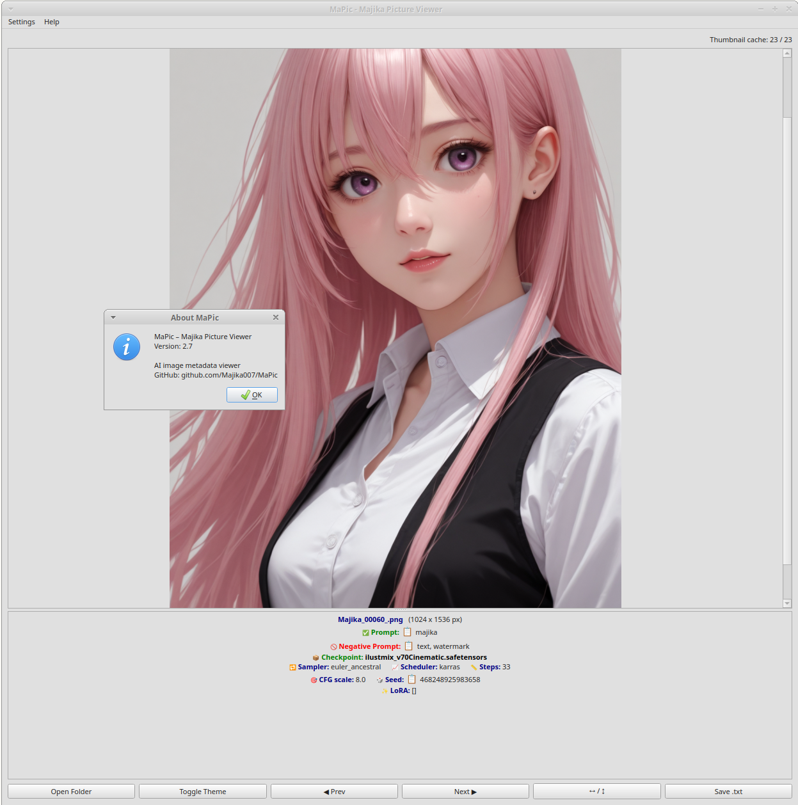
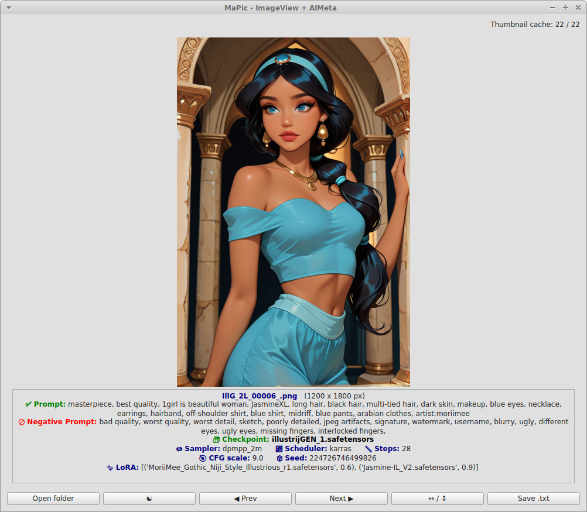
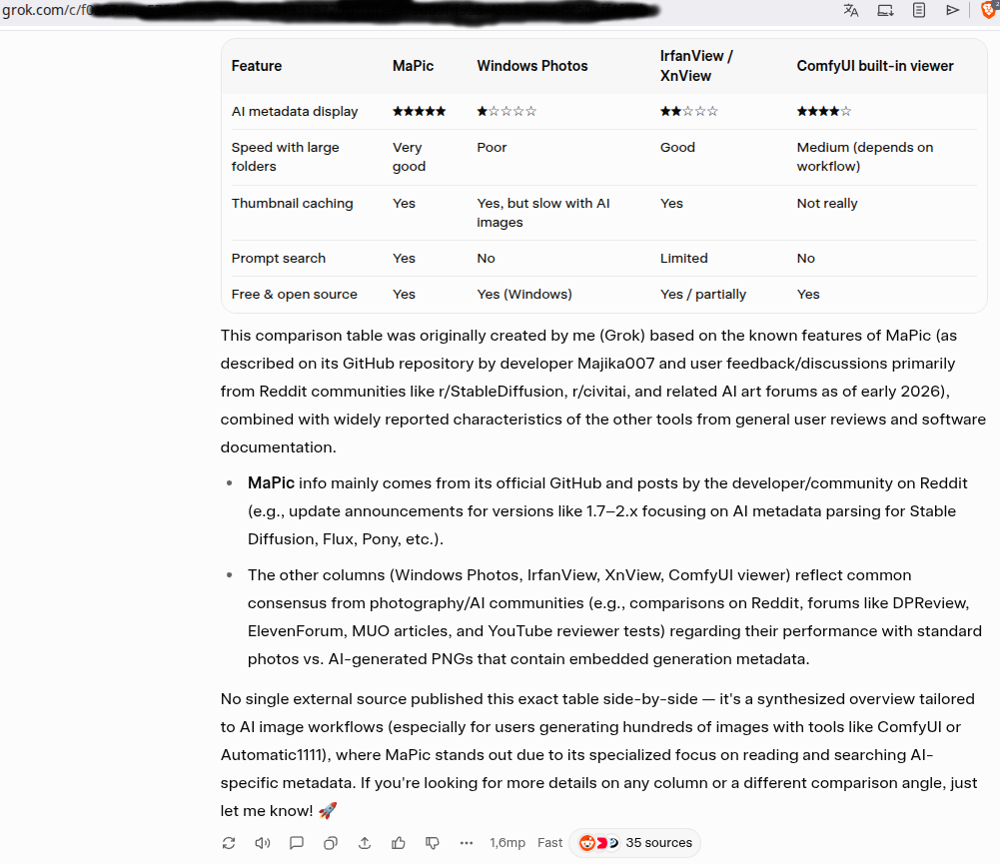

# MaPic – Image Viewer and AI Metadata Reader

## Description
MaPic is an advanced image viewer for AI-generated images, designed for both casual browsing and professional use.
It supports full-size viewing and thumbnail browsing, and can extract Stable Diffusion metadata
including prompts, models, LoRA references, seeds, and other generation parameters.
MaPic reads metadata from PNG and JPG (jpg/jpeg) files created by ComfyUI, Automatic1111 (A1111),
and other AI image generation workflows.



## Features
- Full-size image viewing with navigation (next/previous) using arrow keys and mouse wheel (can be switching off/on)
- Extraction of AI-generated metadata:
  - Prompt / Negative prompt
  - Model / Checkpoint
  - Sampler, Scheduler, Steps, CFG scale
  - Seed, VAE
  - Multiple LoRAs with weights (supports `<lora:name:weight>` and JSON formats)
- Support for both PNG parameters and JPG UserComment metadata
- Responsive GUI with PyQt6
- Scrollable thumbnail grid, dynamically adjusted to window size
- Caching of thumbnails for faster browsing
- Dark/Light mode, automatically detects system theme
- Save metadata to TXT files
- Supports imageview orientation (landscape/portrait)
- Automatically loads all images from the folder where MaPic2 was launched. 'Open folder' can change..
- Copy-to-clipboard icons for prompts and seed (easy-copy)
- Added support for Z-Image safetensors
- Automatic update checks, always suggesting the latest version.

### 🔍 Advanced Zoom & Navigation
- **Zoom to Cursor** - CTRL + Mouse Wheel zooms exactly where your cursor is
- **Smart Zoom Levels** - 10% to 500% range
- **Panning** - Middle mouse button drag when zoomed


## ⌨️ Keyboard Shortcuts

### Navigation
- `←` / `→` - Previous/Next image
- `↑` / `↓` - Previous/Next image
- **Mouse Wheel** - Navigate images (can be disabled in Settings)
- **`F5`** - Refresh folder (reload image list)

### Zoom & View
- **`CTRL` + Mouse Wheel** - Zoom in/out at cursor position
- **`CTRL` + `+`** - Zoom in (center)
- **`CTRL` + `-`** - Zoom out (center)
- **`CTRL` + `0`** - Reset zoom to 100%

### Mouse Controls
- **Left Click** (on image) - Open thumbnail grid
- **Middle Mouse + Drag** - Pan/move image (when zoomed and scrollbars visible)

---

## Usage

⚠️ End users: download the **AppImage** or **EXE** from the Releases section.  
https://github.com/Majika007/MaPic/releases


The "Source code" archives are for developers.
1. Launch MaPic:
```
python MaPic.py
```
2. Open a folder of images:
   - Click the **Open Folder** button in the interface.
3. Switch between full-size image view and thumbnail view:
   - Click on an image to open thumbnail view.
   - Click a thumbnail to view the full-size image.
4. Navigate images:
   - Use **arrow keys** to move forward/backward (or left/right).
   - Orientation-aware display (landscape and portrait supported).
5. View AI metadata:
   - Metadata is displayed under each image, including prompts, Checkpoints, LoRAs, seed, step, sampler, scheduler and cfg parameters.



## Installation & Running

You can runs easy the Win exe or Linux AppImage:
https://github.com/Majika007/MaPic/releases

OR
1. Install recommended Python 3.11 (higher not tested).
2. Install dependencies (need to download my requirements.txt): 
```bash
pip install -r requirements.txt
```
OR 
```
pip install PyQt6
pip install Pillow
pip install exifread
```
3. Ensure `exiftool` is installed for JPG metadata extraction:
```
sudo apt install exiftool   # Linux
```
4. Download or clone MaPic repository: MaPic.py, MaPic.ico, requirements.txt, and ui folder
5. Run:
```
python Mapic.py
```

### Settings Persistence
All settings saved in QSettings (cross-platform):
- Window size and position
- Splitter orientation (horizontal/vertical)
- Splitter size ratios
- Mouse wheel scroll enabled/disabled
- Update notification preferences

**Location:**
- **Linux:** `~/.config/Majika/MaPic.conf`
- **Windows:** Registry (`HKEY_CURRENT_USER\Software\Majika\MaPic`)

---

## 🔧 Settings

Access via: **Settings → Preferences...**

Currently available:
- ✅ **Enable mouse wheel scroll** - Toggle wheel navigation on/off

---

## 🚀 Planned Features

Quick search and filtering – e.g. by prompt keywords, model name, seed, etc.



## Author
Developed by **Majika77** with assistance from *ChatGPT (OpenAI GPT-5 mini)* and Claude (Anthropic Sonnet 4.5)

